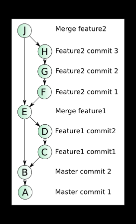

# git-in-practice

TBD, CI, проектирование - всё это помогает нам лучше и быстрее разрабатывать и приносить пользу клиентам.

## Стандартный флоу работы

### Создаём ветку  
```bash
git checkout -b feature/TASK-123 --no-track origin/trunk
```

### Создаём ветку в origin  
```bash
git push -u origin $(git branch --show-current)
```

### Вносим изменения и добавляем их в отслеживаемые  
```bash
git add .
git commit -m TASK-123 Добавлена важная доработка
git push
```

### Готовим ветку к Pull Request
#### Вмёрдживаем основную ветку к себе

```bash
git fetch
git merge origin/trunk
```

#### Делаем squash (один из способов, как по мне самый простой)  
```bash
git reset --soft $(git merge-base trunk HEAD)
git commit -m "TASK-123 Добавлен один красивый коммит"
```

#### Пушим свои изменения  
```bash
git push --force-with-lease
```
Альтернативно - это можно сделать в gitlab/github, там есть функциональность squash and merge.  

## Полезные команды

#### Показать список веток.
```bash
git branch -a
```

#### Посмотреть историю коммитов в виде графика
```bash
git log --graph --oneline --decorate
```

#### Изменить описание последнего коммита
```bash
git commit --ammend -m "Описание коммита"
```

#### Посмотреть изменения между текущей веткой и trunk
```bash
git diff HEAD..origin/trunk
```

## Линейная или нелинейная история 


