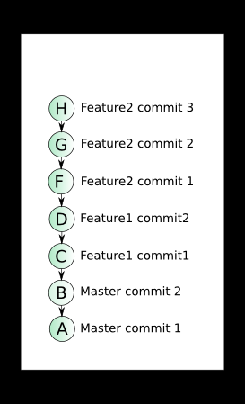

# git-in-practice

TBD, CI, проектирование - как это всё связано

Создаём ветку
`git checkout -b feature/TASK-123 --no-track origin/trunk`
Создаём ветку в origin
`git push -u origin $(git branch --show-current)`

Вносим изменения и добавляем их в отслеживаемые
`git add .`
`git commit -m TASK-123 Добавлена важная доработка`
`git push`

Готовим ветку к Pull Request:
1. Вмёрдживаем основную ветку к себе
`git fetch
git merge origin/trunk`
2. Делаем squash (один из способов, как по мне самый простой)
`git reset --soft $(git merge-base master HEAD)
git commit -m "TASK-123 Добавлен один красивый коммит"`
3. Пушим свои изменения
`git push --force-with-lease`
Альтернативно - это можно сделать в gitlab/github, там есть функциональность squash and merge.

Полезные команды:
`git branch -a` - показать список веток
`git log --graph --oneline --decorate` - посмотреть историю коммитов в виде графика
`git commit --ammend -m "Описание коммита"` - изменить описание последнего коммита.

